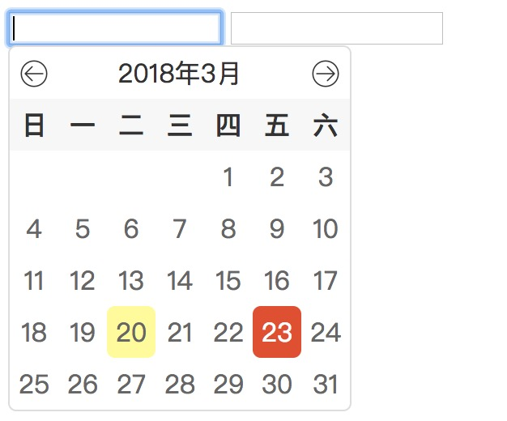

# jQuery-calendar

预览：<http://hekiheki.github.io/jQuery-calendar>



## API

format: 设置日期格式，默认为 'yyyy-MM-dd'

## 如何使用


``` html
// css文件
<link rel="stylesheet" href="calendar.css">
// html 结构示例如下：
<input type="text" id="setDate">
<input type="text" id="setDate1">
```


``` javascript
// 引入jquery文件
<script src="jquery.min.js"></script>
// 引入calendar.js
<script src="calendar.js"></script>
    <script>
        $('#setDate').myCalendar({format: 'yyyy/MM/dd'});
        $('#setDate1').myCalendar();
    </script>
```

